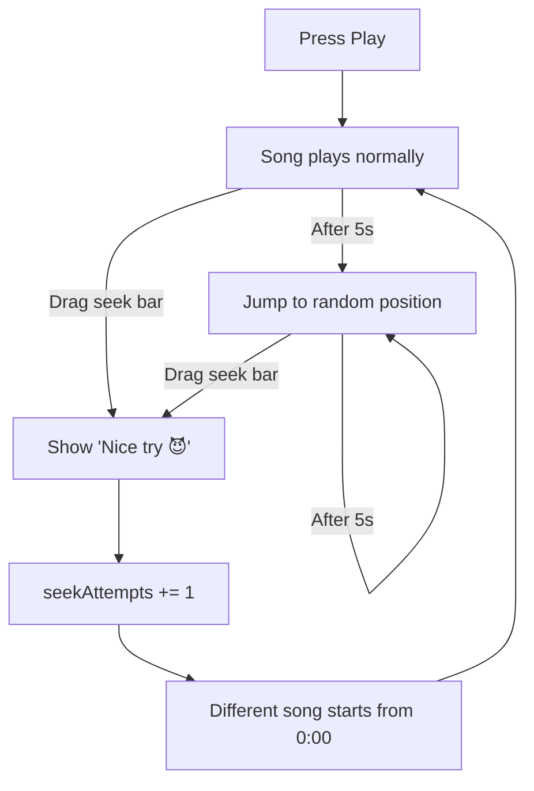

# Anti-Music Player 🎵


## Basic Details
### Team Name: [Milk Biscuits]


### Team Members
- Team Lead: [Akshaya R] - [NSSCE]
- Member 1: [Akshay Krishnan TV] - [NSSCE]

### Project Description
An ultra-modern, Spotify-inspired music player that is as smooth and satisfying as dipping a Milk Biscuit in hot tea.

### The Problem (that doesn't exist)
People are forced to listen to music on boring, generic music players that lack aesthetic flavor and emotional warmth. Also, there's no native warning system to aggressively stop users from illegally seeking through songs they shouldn't be skipping. 

### The Solution (that nobody asked for)
We built an over-engineered, visually stunning music player with glassmorphism, dynamic album art scaling, and a terrifying "ACTION BLOCKED" toast message. It's the perfect blend of modern UI and authoritarian playback control.

## Technical Details
### Technologies/Components Used
For Software:
- Languages used: Dart
- Frameworks used: Flutter
- Libraries used: just_audio
- Tools used: Android Studio / VS Code

### Implementation
For Software:
# Installation
```bash
cd flutter_app
flutter pub get
```

# Run
```bash
flutter run
```

### Project Documentation
For Software:

# Screenshots

*Player View 1*


*Player View 2*

# Diagrams

*Workflow diagram illustrating the Anti-Music Player's chaotic playback logic.*


### Project Demo
# Video
[Demo Video](https://drive.google.com/file/d/1EXC1Jglgp027T32EY__1aX2VZ9pO36C9/view?usp=drivesdk)
*Watch the Anti-Music Player in action, demonstrating its chaotic playback behavior.*

# Additional Demos
None

## Team Contributions
- Akshaya R: UI/UX design, visual styling, and layouts.
- Akshay Krishnan TV: Playback logic, state management, and anti-music features.

---
Made with ❤️ at TinkerHub Useless Projects 


# 🎵 Anti-Music Player (Flutter-only)

> A music player that looks completely normal and behaves like the most annoying app you've ever used — no backend required.

## Overview

**Anti-Music Player** is a satirical Android music player built for fun / a college project demo. It has every visual element you'd expect from a real music app — album art, a progress bar, play/pause controls — but it deliberately refuses to let you listen to a song the normal way.

Every 5 seconds, the currently playing song jumps to a random position. If you try to manually drag the seek bar to fix it, the app punishes you by switching to a different song instead.

This version is **pure Flutter** — no Python/Flask backend and no custom Java code. All song metadata lives in a local JSON asset, and `just_audio` (a standard Flutter package) handles playback natively on Android, so there's nothing extra to run.

## How It Works

```
Press Play
   │
   ▼
Song plays normally ──► after 5s ──► jump to random position ──► after 5s ──► jump again ──► ...
   │
   ▼ (if you drag the seek bar)
"Nice try 😈" ──► seekAttempts += 1 ──► a different song starts from 0:00 ──► cycle repeats
```

## Tech Stack

| Layer | Technology |
|---|---|
| App | Flutter (Dart) |
| Audio playback | `just_audio` package |
| Song metadata | Local JSON asset (`assets/songs.json`) |
| Random position / next song | Plain Dart (`lib/services/song_service.dart`) |
| Platform | Android |

## Project Structure

```
anti_music_player/
├── flutter_app/
│   ├── lib/
│   │   ├── main.dart
│   │   ├── models/song.dart
│   │   ├── services/song_service.dart        # metadata + random-position logic
│   │   ├── controllers/playback_controller.dart  # the anti-music core logic
│   │   ├── screens/home_screen.dart
│   │   ├── screens/player_screen.dart
│   │   └── widgets/
│   │       ├── anti_progress_bar.dart
│   │       └── song_tile.dart
│   ├── assets/
│   │   ├── songs.json
│   │   └── songs/            # put your own .mp3 files here
│   └── pubspec.yaml
└── README.md
```

## Getting Started

### Prerequisites

- Flutter SDK (3.x+) installed and on your PATH
- Android Studio (for the emulator / SDK) or a physical Android device with USB debugging on
- A few of your own locally-owned `.mp3` files

### Run it

```bash
cd flutter_app
flutter pub get
flutter run
```

That's the entire setup. No server, no separate process to keep alive.

### Adding Your Own Songs

1. Copy your `.mp3` files into `flutter_app/assets/songs/`.
2. Edit `flutter_app/assets/songs.json` to match:

```json
{
  "id": 1,
  "title": "Song One",
  "artist": "Artist One",
  "file": "assets/songs/song1.mp3"
}
```

3. Hot-restart the app (not just hot-reload) so the new assets are picked up.

> ⚠️ Don't commit copyrighted audio if you plan to share the repository.

## Core Features

- Clean, dark, minimal music-player UI (home screen + player screen)
- Song list with title and artist
- Play / Pause / Next controls
- Live progress bar with current time / total duration
- Automatic random-position jump every 5 seconds (one active timer at a time — no duplicates)
- Manual seek detection: dragging the progress bar never actually seeks — it triggers a forced song change instead
- Playful on-screen messages when a seek attempt is blocked
- Annoyance counter and level indicator

## How Seek Detection Works

The progress bar (`AntiProgressBar`) is a normal-looking `Slider`, but its `onChanged` callback is a no-op — it never applies the value the user drags to. Instead, `onChangeStart` (fired the instant the user touches the slider) calls `controller.onUserSeekAttempt()`, which increments the counter and immediately switches to a different song. The slider's displayed position always comes from the real playback position stream, so after the switch it just reflects the new song from 0:00.

## Annoyance System

```
seekAttempts += 1        // on every blocked manual seek
annoyanceLevel = min(seekAttempts * 10, 100)
```

| Range | Label |
|---|---|
| 0–20 | Calm |
| 21–40 | Getting annoying |
| 41–60 | Annoying |
| 61–80 | Very annoying |
| 81–100 | WHY ARE YOU STILL TRYING? |

## Testing

| # | Action | Expected Result |
|---|---|---|
| 1 | Play a song | Plays normally |
| 2 | Wait 5 seconds | Jumps to a random position |
| 3 | Wait another 5 seconds | Jumps again |
| 4 | Drag the progress bar | Song immediately changes |
| 5 | Press Pause | Playback and the 5-second timer stop |
| 6 | Press Play again | Playback and random-jump cycle resume |
| 7 | Song reaches its end | Moves to another song (handled via `just_audio`'s completion state — see note below) |
| 8 | Rapidly drag the progress bar | No crashes, no duplicate timers |

> Note: song-end auto-advance isn't wired up in the base code yet — you can add it by listening to `_player.playerStateStream` for `ProcessingState.completed` inside `PlaybackController` and calling `playNext()`.

## Known Limitations

- Not a real music player — playback control is intentionally sabotaged
- Requires your own locally-owned audio files; nothing is bundled
- No backend means no cross-device sync — everything is local to the installed app

## License

For educational/demo use. Do not include copyrighted audio files in this repository.
